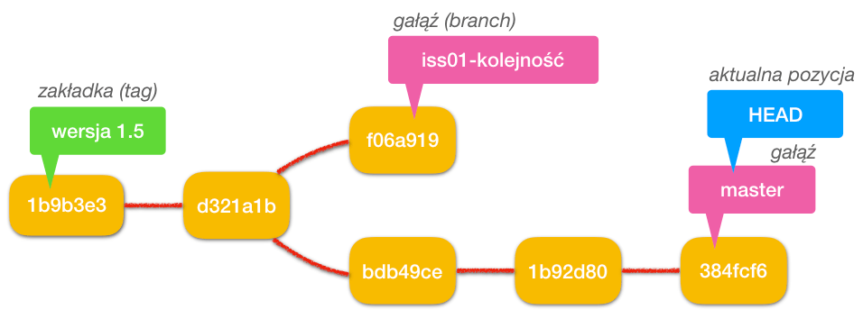
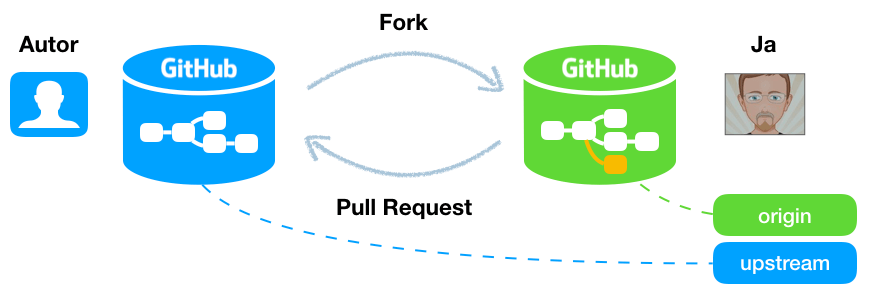
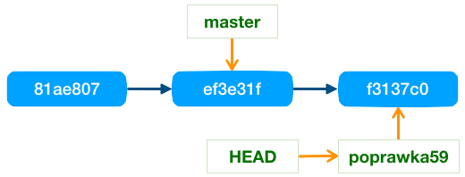
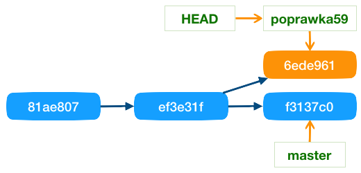
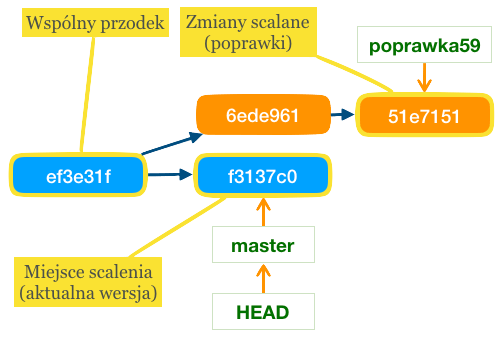

# Git

# Konfiguracja Git-a

1. Pobranie i instalacja Git dla Windows
    * https://git-scm.com/download/win
1. Stworzenie konfiguracji Git-a `plik .gitconfig`:
	* Dane użytkownika
	```sh
	git config --global user.email "you@example.com"
	git config --global user.name "Your Name"
	```
1. Dodanie aliasów do analizy historii  w formie drzewa
	* Modyfikacja pliku pliku konfiguracyjnego `.gitconfig` (lokalizacja: `C:\Users\{{użytkownik}}`)
	```
	[alias]
		graph1 = log --graph --abbrev-commit --decorate --format=format:'%C(bold blue)%h%C(reset) - %C(bold green)(%ar)%C(reset) %C(white)%s%C(reset) %C(dim white)- %an%C(reset)%C(bold yellow)%d%C(reset)' --all
		graph2 = log --graph --abbrev-commit --decorate --format=format:'%C(bold blue)%h%C(reset) - %C(bold cyan)%aD%C(reset) %C(bold green)(%ar)%C(reset)%C(bold yellow)%d%C(reset)%n''          %C(white)%s%C(reset) %C(dim white)- %an%C(reset)' --all
		lg = !"git graph1"
	```
1. Zmiana edytora
    * Klasyczny notatnik - Notepad
    ```sh
    git config --global core.editor C:\Windows\notepad.exe
    ```
    * Notepad++ (**zalecany**)
    ```sh
    git config --global core.editor "'C:/Program Files (x86)/Notepad++/notepad++.exe' -multiInst -notabbar -nosession -noPlugin"
    ```

1. Konto na GitHub
	* Założenie konta GitHub-ie
	* https://github.com/join

# Polecenia Git-a

| Polecenie | Opis |
| --- | --- |
| `git checkout master` | Przełączenie głowy `HEAD` na gałąź `master` |
| `git checkout -b trener` | Założenie gałęzi `trener` oraz przełączenie się na tą gałąź |
| `git checkout --track origin/osoba1` | Stworzenie lokalnej gałęzi |
| `git add .` | Dodanie wszystkich zmienionych plików oraz wszystkich nowych plików do poczekalni |
| `git commit -m "Zmieniono plik XYZ"` | Stworzenie nowej rewizji (commit-a) na bazie poczekalni |
| `git commit -a` | Dodanie wszystkich zmienionych plików do poczekalni oraz stworzenie nowej rewizji (**Uwaga!** Nowe pliki nie zostaną dodane do poczekalni) |
| `git push` | Wysłanie wszystkich rewizji (commit-ów) do zdalnego repozytorium `origin` oraz aktualizacja wskaźnika bieżącej gałęzi na rewizję zgodną z lokalnym repozytorium. Uwaga na opcje `--set-upstream` oraz `--force`  |
| `git fetch` | Pobranie rewizji ze zdalnego repozytorium `origin`  |
| `git merge` | scalenie lokalnego wskaźnika bieżącej gałęzi ze wskaźnikiem zdalnym (*wyjasnić tryb: fast-forward*) |
| `git pull` | `git fetch` + `git merge` |
| `git reset --hard` | wyczyszczenie zmian roboczych oraz zmian w poczekalni |

| Polecenie | Opis |
| --- | --- |
| `git reset -- {nazwa pliku}` | Usunięcie pliku z poczekalni |
| `git reset --hard` | Skasowanie wszystkich zmian w katalogu roboczym oraz w poczekalni |
| `git reset HEAD~2` | cofnięcie aktualnej gałęzi o 2 rewizje bez zmiany plików roboczych |
| `git reset ver-01` | Przełączenie wskaźnika aktualnej gałęzi na tag o nazwie `ver-01`. Nie zmienia zawartości plików w katalogu roboczym |
| `git reset fde6048` | Przestawienie wskaźnika bieżącej gałęzi na rewizję (commit) o ID = `fde6048`. Nie zmienia plików roboczych. |
| `git reset --hard fde6048` | Jak wyżej, ale zmienia pliki robocze na zgodne z rewizją (kasuje zmiany w katalogu roboczym) |

**Git graficzny klient (GUI Git client)**

* Visual Studio Code - https://code.visualstudio.com/
* Sourcetree - Atalasian - https://www.sourcetreeapp.com/ *(BitBacket account)*
* Fork - https://git-fork.com/ *(pay-when-use)*
* wiele innych możliwości ...


-------------------------------------------


# Spis treści

- [Repozytorium Git-a](#repozytorium-git-a)
- [Struktura rewizji](#struktura-rewizji)
- [Komunikacja z Git-em](#komunikacja-z-Git-em)
- [Zdalne repozytorium](#zdalne-repozytorium)
- [Praca grupowa](#praca-grupowa)
- [Ignorowanie plików](#ignorowanie-plików)
- [Praca z gałęziami w Git](#praca-z-gałęziami-w-git)
	- [Zarządzanie gałęziami](#zarządzanie-gałęziami)
	- [Przełączanie między gałęziami](#przełączanie-między-gałęziami)
	- [Rozgałęzianie historii](#rozgałęzianie-historii)
	- [Złączanie gałęzi](#złączanie-gałęzi)
	- [Gałęzie zdalne](#gałęzie-zdalne)
	- [Porządkowanie gałęzi lokalnych](#porządkowanie-gałęzi-lokalnych) 
	- [Porządkowanie gałęzi zdalnych](#porządkowanie-gałęzi-zdalnych) **[[wersja robocza]]**
- [Symulatory Git-a](#symulatory-git-a)


# Repozytorium Git-a

Repozytorium Git-a zawiera zbiór rewizji, które składają się z migawek plików:
* **zbiór rewizji** to zbiór wersji historycznych zarejestrowanych plików, 
* rewizja = zbiór migawek
* migawka piku to pełna kopia danego pliku (nie jest to delta zmian!)

Zbiór migawek w danej rewizji zawiera:
* pełne kopie plików, które zostały zmienione oraz wszystkie nowe pliki 
* wskaźniki do wcześniejszej migawki plików, które nie uległy zmianie

W efekcie system Git ma możliwość natychmiastowego dostępu do dowolnej wersji repozytorium. O wiele prostsze staje się również rozgałęzianie i scalanie różnych wersji plików. Git można traktować jako bardzo wydajny systemem plików z możliwością optymalnego zapamiętania ich wcześniejszych wersji. Systemy wersjonowania kodu starszej generacji (takie jak Subversion i CVS) mają o wiele gorszą wydajność oraz są dużo trudniejsze i bardziej kłopotliwe w zarządzaniu.


# Struktura rewizji

**Identyfikator**. Rewizja jest jest unikalne identyfikowana 40 znakowym kodem SHA-1 (20 bajtów w zapisie heksadecymalnym). Unikalność identyfikatora rewizji jest zapewniona nie tylko w ramach lokalnego repozytorium, ale również globalnie w ramach wielu repozytoriów. Dla łatwiejszego odwoływania się do rewizji w praktyce stosuje się 7-znakowy skrót (pierwsze 7 znaków z 40 znakowego skrótu SHA-1).



**Struktura**. Każda rewizja połączona jest z poprzednią wersją, a dokładniej to *nowsza* wersja wskazuje *starszą*. W efekcie możliwe jest aby jedna *starsza* rewizja była wskazywana równocześnie przez kilka *nowszych* rewizji. Taką sytuację nazywa się rozgałęzieniem.

Poza połączaniami rewizji strukturę budują również wskaźniki Git-a. Jest ich kilka rodzajów:

* **głowa (HEAD)** - aktualnie widoczna w katalogu roboczym rewizja. Głowa może wskazywać dowolną gałąź lub bezpośrednio którąś z rewizji. Każda zmiana (commit) powoduje utworzenie nowej rewizji i przesuniecie głowy

* **gałąź (branch)** - nazwany wskaźnik, który wskazuje dowolną rewizję w repozytorium. Gałąź aktualna to taka, którą wskazuje głowa. Przełączanie się miedzy gałęziami powoduje również aktualizację plików w katalogu roboczym. Jeśli głowa (HEAD) wskazuję gałąź to w momencie zmiany przesuwany jest ten wskaźnik gałęzi na nowo powstałą rewizję. Głowa nadal wskazuje na tą gałąź, czyli pośrednio zostanie "przesunięta".

* **gałąź główna (master)** - tworząc nowe repozytorium, automatycznie tworzona jest gałąź główna o nazwie master. Zazwyczaj wskazuje na aktualną zatwierdzoną wersję wersjonowanych dokumentów.

* **etykieta (tag)** - nazwany wskaźnik rewizji, w odróżnieniu od gałęzi nie przesuwa się w momencie wprowadzenia zmian, czyli stale wskazuje wybraną rewizję. Można ja wykorzystać to wskazania numeru wersji projektu.


# Komunikacja z Git-em

Komunikacja z repozytorium Git oraz zarządzanie nim wykonuje się z linii poleceń przez program `git.exe` (Windows). Podstawowe polecenia git to:

* `git clone <repo-URL>`
    * Klonuje repozytorium zdalne, czyli pobiera wszystkie rewizje oraz informacje o wskaźnikach zdalnych. Zakłada gałąź główną `master` oraz alias `origin` zawierający adres repozytorium zdalnego.
* `git status`
    * Zwraca informację o niezarejestrowanych zmianach w katalogu roboczym oraz o zmianach zarejestrowanych w poczekalni, które czekają na zatwierdzenie
* `git add .`
    * Dodaje do poczekalni wszystkie zmienione i nowe pliki, które są śledzone przez system wersjonowania. W momencie dodania w poczekalni tworzona jest migawka pliku, która po zatwierdzeniu poleceniem `git commit` zostanie dopisana do nowej rewizji
* `git diff`
    * Pokazuje różnice między poczekalnią a ostatnią zatwierdzoną rewizją
* `git commit`
    * Zatwierdza zmiany zarejestrowane w poczekalni: tworzy nową rewizję w lokalnym repozytorium i dodaje do niej przygotowane w poczekalni migawki plików
* `git commit --amend`
    * Korekta. Scalenie zmian oczekujących aktualnie w poczekalni ze zmianami w ostatniej rewizji. W efekcie powstaje nowa rewizja, która tak jest podpinana, że zastępuje aktualną rewizję. Poza poprawkami w plikach można również poprawić nazwę i komentarz rewizji.
* `git push`
    * Wysyła nowe rewizje do repozytorium zdalnego (domyślnie jest to repozytorium o nazwie `origin`). Dodatkowo aktualizuje w zdalnym repozytorium pozycje wskaźników: HEAD i wskaźnika bieżącej gałęzi (domyślnie jest to gałęź master)
* `git pull`
    * Pobiera migawki z repozytorium zdalnego oraz pozycje wskaźników (głowa i bieżąca gałąź) z repozytorium zdalnego a następnie scala różnice z lokalnym repozytorium

Więcej informacji o poleceniach git wraz z dokładniejszym wyjaśnieniem w artykule: [Git: Wizualna ściąga](https://marklodato.github.io/visual-git-guide/index-pl.html) (tłumaczenie angielskiego artykułu: "A Visual Git Reference")


# Zdalne repozytorium

Git jest rozproszonym systemem wersjonowania kodu źródłowego, czyli programista zazwyczaj korzysta ze swojej własnej kopii repozytorium głównego. Lokalne repozytorium jest w pełni autonomiczną kopią repozytorium Git-a. Dzięki takiemu rozwiązaniu możliwe jest zatwierdzanie zmian bez połączenia sieciowego (sieć lokalna lub sieć Internet). 


Repozytorium lokalne tworzone jest na dwa sposoby: 
* poleceniem ```git init``` - powstaje puste repozytorium w katalogu, w którym wydano takie polecenie.
* poleceniem ```git clone [adres_repozytorium_zdalnego]``` - tworzone jest nowe repozytorium będące kopią zdalnego, w takiej sytuacji adres do repozytorium zdalnego zapamiętywany jest po skrótem, nazwanym domyślnie ```origin```.

Zmiany umieszczone w repozytorium lokalnym można w każdym momencie zsynchronizować z repozytorium zdalnym wydając poleceni ```git push```

Sprawdzenie listy zarejestrowanych zdalnych repozytoriów:

```sh
$ git remote -v

origin	https://github.com/bogdanpolak/MARS.git (fetch)
origin	https://github.com/bogdanpolak/MARS.git (push)
upstream	https://github.com/andrea-magni/MARS.git (fetch)
upstream	https://github.com/andrea-magni/MARS.git (push)
```

Rejestracja repozytorium:

```sh
$ git remote add xstream https://github.com/andrea-magni/MARS.git
```


# Praca grupowa

### Wariant GitHub/OpenSource - zgłaszanie PullRequest-ów

Typowym schematem pracy w repozytoriach OpenSource jest zgłaszanie zmian, które wprowadzamy najpierw w swoim zdalnym repozytorium projektowym (`origin`). Portale takie GitHub analizują różnice między repozytorium autorskim (źródłowym) a jego klonem (`fork`) i gdy w naszym sklonowanym repozytorium pojawiają się nowe rewizje to możemy w prosty sposób zgłosić żądnie aktualizacji (`pull request`).



Nasze repozytorium zdalne domyślnie nazywane jest `origin` i tej nazwy warto się trzymać. Z kolei nadrzędne zdalne repozytorium autorskie nazywane jest w skrócie `upstream`.

Odwoływanie się do repozytorium autorskiego umieszczonego w chmurze możliwe jest za pomocą długie adresu URL. Wpisywanie tego adresu za każdym razem konieczne jest mało wygodne, dlatego definiujemy skrót do tego repozytorium, który nazwiemy `upstream`. Nowy skrót dodajemy poleceniem:

```
git remote add <nazwa-skrótu> <adres-url>
```
Na przykład:

```
git remote add upstream https://github.com/andrea-magni/MARS.git
```

Po zgłoszeniu żądania aktualizacji `pull request` autor przegląda zmiany i decyduje co z nimi zrobić: może poprosić o naniesienie poprawek lub sam dokonuje korekt. Takie poprawki mogą rozciągnąć się na kilka rewizji. Czasem są to ważne zmiany, a czasem drobne literówki. Na koniec autor decyduje w jaki sposób taki pakiet zmian "przenieść" do swojego głównego repozytorium. Mamy tutaj kilka strategi takiego przenoszenia. 

Zazwyczaj autorzy decydują się na scalenie zmian, czyli łączą wszystkie rewizje wchodzące w skład jednego żądania (`pull request`) w jedną, scaloną rewizję. W takim scenariuszu w repozytorium autora (`upstream`) powstaje nowa rewizja, której nie ma ani w moim repozytorium zdalnym (`origin`), ani lokalnym. Stąd konieczne jest pobranie zmian z repozytorium zdalnego `upstream` do naszego lokalnego repozytorium, scalenie różnic i aktualizacja naszego zdalnego repozytorium (`origin`).

Pobranie zmian z repozytorium zdalnego wykonujemy poleceniem:

```
git fetch <repo-url> master
``` 

Polecenie `git fetch` pobiera jedynie nowe migawki oraz nowe rewizje z repozytorium zdalnego i nie scala je z naszą lokalną rewizją bieżącą (`HEAD`). Dzięki temu możemy przeanalizować różnice i dopiero po upewnieniu się co do stanu zmian przełączyć głowę `HEAD` na aktualną wersję stworzoną przez autora.

Pełna procedura aktualizacji repozytorium lokalnego oraz repozytorium zdalnego `origin` na podstawie zmian w repozytorium zdalnym `upstream` wygląda następująco:

```sh
git fetch upstream master
git reset --hard upstream/master
git push --force
```

* Polecenie `git reset --hard` przenosi aktualną gałąź na pozycję `upstream/master` i modyfikuje wszystkie pliki w katalogu roboczym zmieniając je do stanu zgodnego z tą rewizją.
* Polecenie `git push --force` wymusza aktualizację zdalnego repozytorium, w efekcie znikną (będę nie widoczne) nasze drobne korekty i zastąpi je jedna scalona zmiana.

### Wariant z rozgałęzianiem

Najczęściej stosowanym sposobem pracy z repozytorium Git jest korzystanie w wielu gałęzi. Programiści przyzywaczajeni do starszych systemów wersjonowania takich jak `CVS` lub `Subversion` obawaiją się stosowania wielu gałęzi i zarządzania nimi. W przypadku Git-a jest to podstawowy tryb pracy.

Przez wiele lat korzystania z repozytorium Git ukształtował się ogólnie przyjęty standard używania długo-trwałych i chwilowych gałęzi. Wymienione dalej artykuły omawiają dokładniej ten teamt, ogólnie znany jako `Git Branching Model` lub `Git Branch Strategy`:

- A successful Git branching model - https://nvie.com/posts/a-successful-git-branching-model/ (Vincent Driessen, 5 stycznia 2010)

### Wariant z spakowaną liniową historią

Squash and merge to strategia w Git scalania małych, samodzielnych rewizji w jedną większą rewizję. Dzięki takiemu podejściu historia zmian jest bardziej przejrzysta. Połączone małe commity ułatwiają cofanie zmian. Gałąź główna (`master` / `main`) pozostaje czysta i zawiera tylko istotne zmiany.

Wykonanie squash spowoduje, że wszystkie nasze commity z gałęzi roboczej zostaną połączone w jeden commit i zostaną wprowadzone do gałęzi głównej:

```
git merge --squash feature
```
Stworzenie nowej rewizji złączonymi zmianami:
```
git commit -m "<commit message here>"
```


# Ignorowanie plików

Git sprawdza zawartość pliku `.gitignore`, który jest wykorzystywany w momencie rejestrowania zmian. Pomijane są wszystkie pliki zapisane w `.gitignore` (zapisujemy pełną nazwę pliku lub wzorzec do którego pasuje wiele plików). Ignorować można również katalogi.

### Pliki projektu RAD Studio (Delphi i C++Builder)

W przypadku projektów RAD Studio poza plikami binarnymi, które łatwo jest wykluczyć trudności powodują pliki projektu (`*.dproj` lub `*.cbproj`) oraz pliki grupy projektów. Są to pliki XML, które są automatycznie zapisywane przez środowisko i programista nie ma kontroli nad ich formatem i zawartością. Niestety środowisko potrafi znacznie zmodyfikować taki plik przy drobnej zmianie. Dlatego warto usuwać ten plik z systemu wersjonowania, z którego korzysta kilku programistów. Jednak nie zawsze jest to możliwe.

Jeśli plik projektu musi być w repozytorium to warto zadbać o to, aby dodawać go tylko, gdy jest to konieczne, a nie przy każdej zmianie. Jednym z rozwiązań jest ręczne przełączanie flagi `Skip-worktree` dla tego pliku. Ustawienie tej flagi spowoduje pomijanie tego pliku, przy kolejnych rejestracjach zmian.

* Ustawienie flagi `Skip-worktree` 
```
git update-index --skip-worktree Project1.cbproj
```


# Praca z gałęziami w Git


## Zarządzanie gałęziami

Do operacji pozwalających na zarządzanie gałęziami można zaliczyć:

1. Tworzenie gałęzi
2. Usuwanie gałęzi
3. Przesuwanie gałęzi

Do tworzenia oraz do zarządzania gałęziami służy głównie polecenie ```git branch```, aby dodać nową gałąź należy do tego polecenia dodać nazwę gałęzi, która musi być unikalna w ramach całego repozytorium. Przykładowe polecenie tworzące nową gałąź:

```
git branch poprawka59
```

Podobnie usunięcie gałęzi jest wykonuje się tym samym poleceniem dodając opcję ```-d``` lub ```--delete```, tak jak na poniższym przykładzie:

```
git branch -d poprawka59
```

Nie można w ten sposób usuwać gałęzi, które nie zostały scalona z resztą drzewa, czyli gdy ta gałąź nie zawiera się w historii innej gałęzi. Blokada ta wynika z faktu, że rewizje podczepione do takiej gałęzi mogą zniknąć z historii repozytorium po usunięciu jedynego wskaźnika do nich.

Jeśli w takiej sytuacji mimo wszystko chcemy usunąć taką gałąź to musimy dodać opcję `--force` lub `-f`, w skrócie można napisać `-df` lub jeszcze krócej `-D`:

```
git branch -D poprawka59
```

W strukturach repozytorium gałąź jest obiektem, który wskazuję na aktualną rewizję, z kolei ta rewizja wskazuje na wcześniejszą rewizję (wersję) itd. Czyli struktura przykładowego repozytorium z jedną gałęzią `master` mogłaby wyglądać w ten sposób:


Wskaźnik ```HEAD``` to bieżące miejsce, czyli miejsce w które są wstawiane nowe zmiany `git commit` oraz gdzie wykonywane są inne bieżące informacje, takie jak `diff` i wiele innych.

Usuwając gałąź do repozytorium lub dodając ją robimy tylko prostą operacje usunięcia lub dodania nowego obiektu wskazującego pewną wersję. Bardzo ważne, że do jej ukończenia nigdy nie trzeba przebudowywać aktualnej struktury repozytorium.

Równie łatwo jak dodawać/usuwać można także przesuwać gałąź na aktualną rewizję (`HEAD`). Spójrzmy na przykład:


Gałąź `poprawka59` ustawioną jest na wcześniejszej rewizji, jeśli chcemy ją przestawić na aktualne miejsce to możemy usunąć gałąź i od razu ją dodać:

```
git branch -d poprawka59
git branch poprawka59
```

Dla uproszczenia operacji można zignorować wszystkie ostrzeżenia i dodać już istniejącą gałąź z opcją ```-f``` lub ```--force```:

```
git branch -f poprawka59
```

W wyniku wywołanych poleceń przesuniemy gałąź na bieżącą wersję w historii rewizji:


## Przełączanie między gałęziami

Przełączenie między gałęziami wykonuje polecenie ```git checkout```. Gałąź na którą chcemy się przełączyć podajemy jako parametr:

```
git checkout poprawka59
```

Po wykonaniu tej operacji, głowa ```HEAD``` zostanie przestawiona na gałąź ```poprawka59```, czyli bieżące operacje będą wykonywane w tym miejscu: 


Po zatwierdzeniu zmian zostanie utworzona nowa rewizja, a wskaźnik gałęzi przesunięty na nią:



Kolejne przełączenie się na gałąź ```master```, spowoduje, że w plikach roboczych znikną wprowadzone wcześniej zmiany. Wywołujemy:
 
```
git checkout master
```

Głowa zostaje przełączona na gałąź ```master```, a pliki znajdujące się katalogu roboczym zostaną zmodyfikowane tak, aby wyglądały tak jak wcześniej, czyli przed wprowadzoną zmianą. Jednak zmiany nie znikają na stałe, ponieważ są już utrwalone w repozytorium i każdej chwili można się na nie przełączyć wywołując polecenie ```git checkout poprawka59```

Polecenie ```git checkout``` pozwala przełączyć ```HEAD``` na dowolną rewizję w repozytorium (nie tylko na którąś z gałęzi). W tym celu musimy znać identyfikator wersji lub jego skróconą wersję (7 znaków). Patrząc na przykłady podane wcześniej widać, że jedna z wcześniejszych rewizji identyfikowana jest skrótem: ```81ae807```. Przełączając się w takie miejsce powinniśmy równocześnie utworzyć nową gałąź w tym miejscu, aby nie otrzymać tzw. odczepionej głowy. Do utworzenia nowej gałęzi służy opcja ```-b```:

```
git checkout b8f9e20 -b eksperyment
```

Jeśli gałąź może już istnieć to trzeba ją przestawić na bieżące czyli zresetować. Można to zrobić przy pomocy opcji ```-B```. Tak jak w przykładzie:

```
git checkout -B patchBP
```

Co jest równoważne poleceniom:

```
git branch -f patchBP
git checkout patchBP
```

## Rozgałęzianie historii

Gałąź w Git to lekki obiekt (ma niewielki rozmiar), który wskazuje na najnowszą zmianę (rewizję). Wprowadzając zmianę raz w jednej gałęzi, a następnie w drugiej możemy rozgałęzić historię rewizji naszego repozytorium.

Git podobnie jak każdy system wersjonowania plików pozwala rozgałęziać historię, co ważne w tym systemie jest to wyjątkowo lekka i bardzo bezpieczna operacja. Co zachęca do jej częstego używania. W systemach starszej generacji takich jak ```CVS``` lub ```Subversion``` jest to bardzo ciężka operacja, którą można używać tylko w niezbędnych sytuacjach.

W systemie Git rozgałęzienie polega na stworzeniu w strukturach repozytorium nowego obiektu - gałęzi, który wskazuję aktualną rewizję. Gałąź nie tworzy kopii swojej własnej historii i działa lokalnie, dzięki czemu jest wykonywana błyskawicznie.

Aby rozgałęzić historię wystarczy przełączyć się na gałąź ustawioną gdzieś na starszej niż aktualna rewizji w historii repozytorium i zatwierdzić zmianę.



## Złączanie gałęzi

Zapewne w krótkim czasie po rozgałęzieniu historii konieczne okaże się jej złączenie, aby lepiej na czym polega rozstrzyganie konfliktów podczas scalania gałęzi rozpatrzmy opisany dalej scenariusz.

Wcześniej stworzyliśmy gałąź ```poprawka59``` przeznaczoną do przygotowania łatki dla błędu nr 59. Przyjmijmy, że do zrealizowania tego zadania potrzebne były dwie rewizje (na diagramie poniżej są to rewizje ```6ede961``` oraz ```51e7151```). Teraz chcemy scalić te zmiany z gałęzią główną, ale w między czasie pojawiła się w niej nowa rewizja (```f3137c0```). Niestety zwykłe przepisanie zmian do gałęzi głównej ```master``` nie jest możliwe, ponieważ modyfikowane były te same pliki w obu gałęziach. W takiej sytuacji musi dojść do trójstronnego scalenia.



Polecenie ```git merge``` informuje system o potrzebie scalenia aktualnej pozycji (```HEAD```) ze wskazaną jako parametr gałęzią. 

```
git merge poprawka59
```

Wróćmy do opisanej wcześniej i rozrysowanej na diagramie sytuacji. Znajdujemy się na gałęzi ```master```, którą próbujemy scalić z gałęzią ```poprawka59```. Po wydaniu powyższego polecenia, system najpierw odszuka ***wspólnego przodka*** i ustali, że doszło do rozgałęzienia. Również ustalone zostaną zmiany wprowadzone w obu gałęziach, czyli mamy 3 wersje zaangażowane w proces scalania (oznaczone na żółto na powyższym diagramie). Po weryfikacji różnić w tych trzech miejscach system ustali czy scalenie może zostać wykonane automatycznie. 

Jeśli zmienianie były różne pliki w obu gałęziach to łatwo można złączyć wszystkie zmiany. Również jeśli obie gałęzie zmieniały ten sam plik, ale w różnych miejscach (różnych liniach) to również można połączyć wszystkie zmiany automatycznie. Jednak jeśli w obu gałęziach zmieniono tą samą linie to wtedy mamy konflikt, który musi rozstrzygnąć użytkownik.

> **TODO:** Wytłumaczyć jak działa merge i kiedy trzeba go używać (wspomnieć o przepisywaniu historii jako rozwiązaniu alternatywnym)

## Gałęzie zdalne

W historii repozytorium poza wskaźnikami jakimi są gałęzie mogą występować zupełnie innego typu wskaźniki. Są one pobrane ze zdalnych repozytoriów przy pomocy operacji ```fetch``` lub ```pull```. W czasie powyższych operacji są pobierane informacje o pozycji gałęzi w zdalnym repozytorium. 

Ta sama gałąź może wskazywać zupełnie inną rewizję w repozytorium lokalnym i inną zdalnym. Stąd gałęzie zdalne są nazywane z dodaniem jako prefiksu nazwy zdalnego repozytorium, czyli: {nazwa repozytorium}/{nazwa gałęzi}, na przykład: ```origin/master``` lub ```jankowalski/master```.

Należy unikać nazywania gałęzi lokalnych nazwami w takim formacie, czyli lepiej w ogóle nie używać znaku ```/``` w nazwach gałęzi lokalnych, aby nie wprowadzać w błąd mniej doświadczonych użytkowników.

Gałęzie zdalne są traktowane zupełnie inaczej niż gałęzie lokalne i zachowują się podobnie jak etykiety (tags). W efekcie nie można, na przykład, przełączyć ```HEAD``` na taką gałąź. Czyli po wywołaniu poniższego polecenia głowa zostanie przełączona na rewizję wskazywaną przez gałąź zdalną, ale będzie wskazywała bezpośrednio tą rewizję, a nie gałąź ```origin/master```.

```
git checkout origin/master
```

Dostajemy następującą sytuację, czyli odłączoną głowę.


Nie jest to zalecany stan i raczej powinno się unikać sytuacji gdy głowa nie wskazuje jednej z lokalnych gałęzi. Jeśli potrzebujemy wykonywać zmiany na tym miejscu to taką operację ```git checkout``` powinniśmy wykonać z opcją ```-b```, dodając nową gałąź.

Już wspomniałem wcześniej jak są aktualizowane pozycje wskaźników zdalnych, 

Pozycje gałęzi zdalnych są aktualizowane w zdalnym repozytorium w momencie wysyłania tam zmian, czyli podczas operacji ```git push```. W takiej sytuacji pozycja gałęzi zdalnej jest aktualizowana zgodnie z pozycją gałęzi lokalnej, pod warunkiem, że nie ma konfliktów z aktualną pozycją tej gałęzi na serwerze. Jeśli taki konflikt występuje to cała operacja jest uznawana za niebezpieczną i system odmawia jej wykonania. Gdy chcemy ją wykonać mimo wszystko to trzeba ją wymusić opcją ```-f```, tak jak w przykładzie:

```
git push -f origin master
  # origin = zdalne repozytorium
  # master = gałąź
```

Choć czasami wykonanie takiej operacji jest konieczne to jednak lepiej jej unikać, aby nie utrudniać życia innym użytkownikom repozytorium. Zasadniczo nie należy tego robić na repozytoriach współdzielonych przez kilku programistów. Zawsze można złączyć obie gałęzie

Tak samo informacje o gałęzi zdalnej se pobierane podczas wykonania operacji:

```
git pull origin master
```

## Porządkowanie gałęzi lokalnych

Lista gałęzi scalonych z gałęzią główną (master) 
```
git branch --merged master 
```
Lista gałęzi scalonych z HEAD, czyli z głową bieżącej gałęzi
```
git branch --merged 
```

Lista gałęzi **niescalonych** z HEAD (j.w.)
```
git branch --no-merged
```

## Porządkowanie gałęzi zdalnych

Aktualizacja zapamiętanej lokalnie listy zdalnych gałęzi w śledzonych zdalnych repozytoriach (```prune cache```)

```
git fetch -p origin
git fetch --prune origin
```

Angielski opis z dokumentacji ```fetch --prune```

> ```Before fetching, remove any remote-tracking references that no longer exist on the remote. Tags are not subject to pruning if they are fetched only because of the default tag auto-following or due to a --tags option. However, if tags are fetched due to an explicit refspec (either on the command line or in the remote configuration, for example if the remote was cloned with the --mirror option), then they are also subject to pruning```

Tworzenie gałęzi lokalnej na bazie gałęzi zdalnej

```
git checkout --track origin/poprawka61
```


Lista gałęzi lokalnych i zdalnych
```
git branch --all
git branch -a
git branch --remote
git branch -r
```

Kasowanie gałęzi zdalnej

```
git push origin --delete pg-branches-v1
```

Wersja skrócona:

```
git push origin :pg-branches-v1
```


# Symulatory Git-a

Dwa przykłady z wielu (wystarczy poszukać):

1. Symulator z zadaniami oraz z wizualizacją w formie grafu
  * [Learning Git Branching](https://learngitbranching.js.org)
  * Ciekawe zadania pozwalające głębiej poznać pracę z gałęziami w Git-cie
  * Zadania w języku angielskim
  
2. Fajna wizualizacja na grafie do własnych eksperymentów
  * [Visualizing Git](http://git-school.github.io/visualizing-git/)
  * Dokładne odwzorowanie rewizji w Git-cie
  * Symulacja repozytorium lokalnego i zdalnego (origin)
